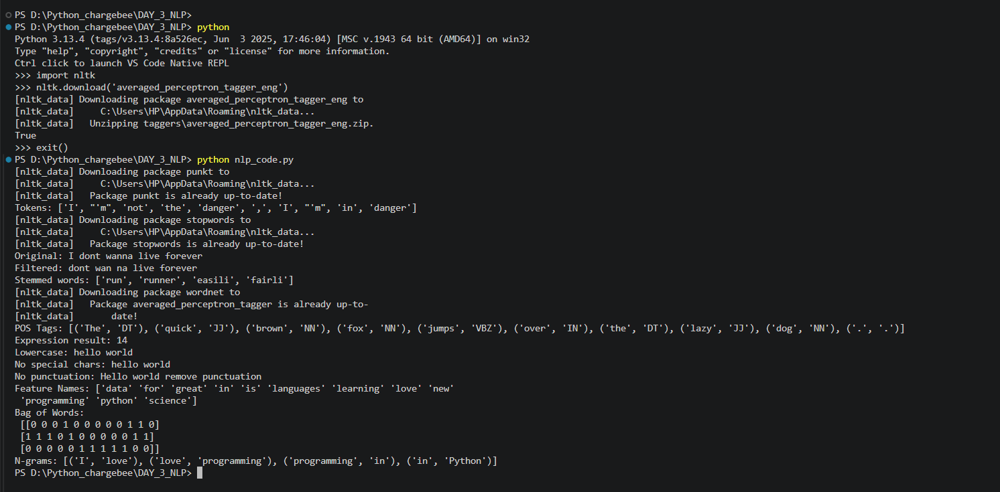

# 🧠 Day 3: Natural Language Processing (NLP)

This session introduces the basics of NLP using Python libraries like NLTK and Scikit-learn.

---

## 📌 Topics Covered

### 1. Tokenization

Splitting text into words or tokens.

---

### 2. Stop Words Removal

Removing common words like "is", "the", "and" which do not add much meaning.

---

### 3. Stemming

Reducing words to their root form.

* Example: running → run

---

### 4. Lemmatization

Converting words to meaningful base form.

* Example: better → good

---

### 5. Parts of Speech (POS) Tagging

Identifying grammatical roles:

* Noun, Verb, Adjective, etc.

---

### 6. Text Preprocessing

* Lowercasing
* Removing special characters
* Removing punctuation

---

### 7. Bag of Words (BoW)

Converting text into numerical representation.

---

### 8. N-grams

Creating combinations of words:

* Bigram (2 words)
* Trigram (3 words)

---

## 🎯 Learning Outcomes

By the end of this session, you should be able to:

* Clean and preprocess text data
* Tokenize sentences
* Remove stopwords
* Apply stemming and lemmatization
* Convert text into numerical features
* Understand basic NLP pipelines

---

## 💻 How to Run

```bash id="s4o3kp"
pip install nltk scikit-learn
python nlp_basics.py
```

---

## ⚠️ Note

First run will download required NLTK datasets.

---

## 📊 Sample Output

When you run the program, you should see output like:

```bash
Tokens: ['I', "'m", 'not', 'the', 'danger', ',', 'I', "'m", 'in', 'danger']

Original: I dont wanna live forever
Filtered: dont wan na live forever

Stemmed words: ['run', 'runner', 'easili', 'fairli']

Lemmatized words: ['run', 'runner', 'easily', 'fairly']

POS Tags:
[('The', 'DT'), ('quick', 'JJ'), ('brown', 'NN'), ('fox', 'NN'),
 ('jumps', 'VBZ'), ('over', 'IN'), ('the', 'DT'),
 ('lazy', 'JJ'), ('dog', 'NN'), ('.', '.')]

Expression result: 14

Lowercase: hello world

No special chars: hello world

No punctuation: Hello world remove punctuation

Feature Names:
['data' 'for' 'great' 'in' 'is' 'languages' 'learning'
 'love' 'new' 'programming' 'python' 'science']

Bag of Words:
[[0 0 0 1 0 0 0 1 0 1 1 0]
 [1 1 1 0 1 0 0 0 0 1 1 1]
 [0 0 0 0 0 1 1 1 1 1 0 0]]

N-grams:
[('I', 'love'), ('love', 'programming'),
 ('programming', 'in'), ('in', 'Python')]
```





## 🚀 Next Step

Day 4: GenAI Tools & Applications